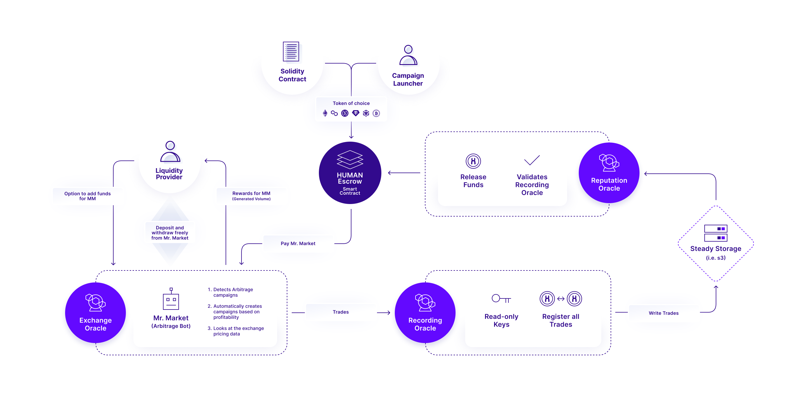
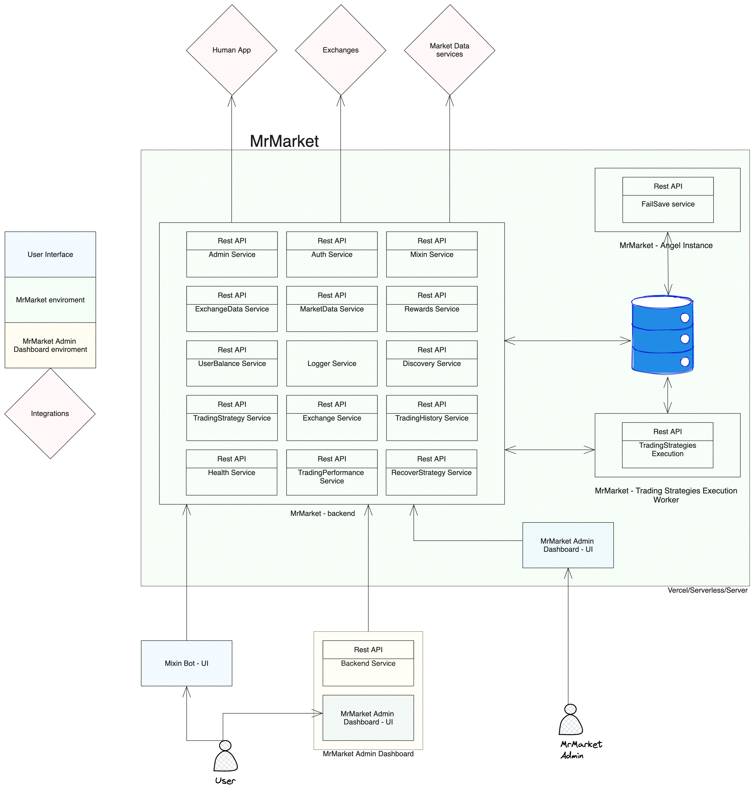
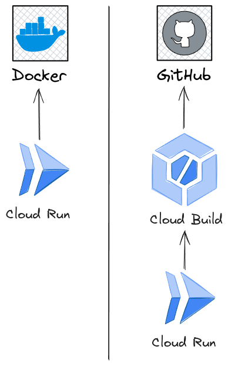

# MrMarket - V2.1 architecture

# Introduction

---

The purpose of this document is to design the architecture for version 2 of [MrMarket](https://github.com/Hu-Fi/Mr.Market).

The V2 version will be developed in parallel with the V1 version by the BlockyDevs team.

## MrMarket - Introduction

The crypto markets are characterized by their fragmented markets, where each cryptocurrency product on every exchange often requires its own market-making. Some products are quoted in USD, USDC, USDT, or even foreign currencies. In essence, each crypto exchange has an isolated order book for each trading pair. In addition, derivative and future products are also disjointed. This differs from traditional markets, which have regulated, centralized market-making where the futures markets are well hedged. In the crypto sector, each product must manage its market-making independently in a one-off manner on each exchange it launches on. Market making is a lucrative industry but it’s currently only available to the largest crypto actors and the average crypto user has no way to participate. Projects create one-off agreements between market makers potentially with a subset of the exchanges they trade on. Recently DeFi markets have allowed for some programmatic market making directly from solidity but they represent a tiny fraction of the overall crypto market.

### Goal

The goal is to democratize market-making in the crypto market, enabling every user to profit from market-making and thereby reducing the overall market-making costs.

### How does it work?

Through the utilization of the Human protocol, any entity (be it an exchange, project, or retail user) can initiate a market-making campaign. They simply need to specify the parameters, deposit the reward, and launch the campaign. This can be accomplished via a web interface or programmatically through a smart contract.

Subsequently, any user wishing to participate in the market-making campaign needs only to provide their READ Keys to the Human protocol. With this, the Human protocol automatically verifies the user's contribution to the campaign and disburses their share in rewards.

Following this, the user can either manually engage in market-making or opt for automatic market-making facilitated by the MrMarket bot.

### Functionality

- Trading bot (Multiple strategies)
- Market Making
- Trading platform

# Technical documentation
The purpose of this technical documentation is to provide an overview of the proposed architecture for Version 2 of MrMarket.

## Materials

- [MrMarket](https://github.com/Hu-Fi/Mr.Market) repository
- [HuFi](https://github.com/Hu-Fi/hufi) repository

## Goals & Requirements

- Simplify the process for users to launch their instance of MrMarket.
    - The instance should be easy to deploy on Vercel.
- Research stateless and serverless solutions, although these are not mandatory requirements.
- Ensure that the developed V2 is ready for a security review by Trail of Bits.
- The code should have a test coverage of a minimum of 80%.

## User stories

### **As a MrMarket User**

1. As a user, I want to be able to use MrMarket as a Mixin bot.
2. As a user, I want to be able to deposit tokens.
3. As a user, I want to withdraw tokens in whatever LP format is available to me.
4. As a user, I want to be able to discover available MrMarket instances and choose which one to connect to.
5. As a user, I want to be able to set up predefined trading strategies.
6. As a user, I want to be able to execute market-making strategies.
7. As a user, I want to see my trading history.
8. As a user, I want to view my portfolio performance.
9. As a user, I want to earn rewards for my participation in market-making.
10. As a user, I want to withdraw the rewards I earned from market-making.

### **As a MrMarket Instance Owner**

1. As an instance owner, I want to run my MrMarket instance easily.
2. As an instance owner, I want to easily host my instance on Vercel.
3. As an instance owner, I want to configure my instance fees easily.
4. As an instance owner, I want to add new trading strategies easily.
5. As an instance owner, I want my instance to be discoverable by MrMarket users.
6. As an instance owner, I want my instance to participate in market-making.

### As a MrMarket Admin

1. As an admin, I want to have access to an admin dashboard.
2. As an admin, I want to be able to see the total volume (daily, weekly, monthly) of this MrMarket instance.
3. As an admin, I want to see the total fees that my MrMarket instance has earned.
4. As an admin, I want to be able to withdraw the fees that I have earned.
5. As an admin, I want to be able to see the portfolio of my MrMarket instance.
6. As an admin, I want to see the performance of my MrMarket instance.
7. As an admin, I want to see the performance of the users.

## Tech Stack

### MrMarket - backend

- NestJS (TypeScript)
- Database: PostgreSQL
- ORM: TypeORM

### Mixin Bot - UI

### MrMarket Admin Dashboard - UI

- React(TypeScript)
- Vite

### MrMarket Discovery Dashboard

- React(TypeScript)
- Vite

## Components

### MrMarket - backend

The backend server is responsible for the business logic of MrMarket. It will handle user withdrawals and rewards, execute various trading strategies, monitor user balances, and calculate and pay out rewards for market-making. Additionally, it should be discoverable by the MrMarket Discovery Dashboard [[MrMarket Discovery Dashboard](#MrMarket-Discovery-Dashboard-App) ].

### → Backend architecture

We will adopt a **Hexagonal Architecture** for the backend application.

**Hexagonal Architecture, also known as Ports and Adapters Architecture, promotes a clear separation of concerns within an application.** It emphasizes isolating the core business logic from external dependencies and infrastructure concerns. By dividing the application into three main layers—the application core, ports, and adapters—Hexagonal Architecture enables developers to create modular and highly maintainable codebases.

### —> Fail-Safe & Recovery, aka “Angel” Instance

The application processes cryptocurrency trades, making it crucial for the app to fail safely and recover from failures. The V1 version currently stores a lot of information in-memory, which is problematic in case the app shuts down unexpectedly.

The V2 version will store each step, progress, phase, and its status in a database. This ensures that if the app fails or shuts down, no important data will be lost. Additionally, we will have an optional separate runner (referred to as the “Angel Instance”), which will connect to the same database and monitor the health of the MrMarket instance. If the number of failed health checks meets a specified threshold, the Angel Instance will execute the fail-safe procedure based on the data state in the shared database.

### —-> Fail safe strategy

Each instance owner will be able to implement their own fail-safe strategy for the Angel Instance. The default strategy will close all active orders and trades on each exchange to reduce market risk in case the MrMarket instance fails.

Decision explanation: [Angel instance](#Angel-instance) 

### —-> Recovery strategy

In case the fail-safe procedure is executed, the database will contain all the actions that were performed. During start-up, the MrMarket instance will have all the data needed to recover to the state before the shutdown. There are multiple ways to handle recovery:

1. **Automatic Recovery**: This method reactivates all the strategies and orders that were active before the shutdown, returning the system to its previous state.
2. **Manual Recovery**: This method does not reinstate the strategies and orders automatically, but waits for the user to restart them.

These options provide flexibility in how the recovery process is managed, allowing for either immediate continuity or user-controlled resumption of activities.

### → Key services

This section will highlight the key services and their high-level roles in the backend application.

### —> Admin service

This service will be responsible for the admin dashboard functionalities

### —> Auth service

This service will be responsible for authorization and authentication. It will protect the given endpoints from unauthorized access. There will be two roles: Admin and User.

### —> Mixin service

This service will be responsible for all integrations with the Mixin Bot [[Mixin Bot - UI](#Mixin-Bot-UI) ] and Mixin [[Mixin One](#mixin-one) ] itself.

### —> ExchangeData service

This service will be responsible for gathering data from the different supported exchanges. It will retrieve market data either through REST APIs or WebSockets from these exchanges.

### —> MarketData service

This service will be responsible for fetching and aggregating market data. It will have the capability to integrate with multiple providers, such as [Coingecko](https://www.coingecko.com/), for data retrieval.

### —> Rewards Service

This service will be responsible for calculating users' contributions to market-making campaigns and determining their rewards accordingly. Additionally, it will manage the distribution of rewards(inside the app).

### —> UserBalance Service

This service will be responsible for managing users' balances within the application.

### —> Logger Service

This service will be responsible for generating readable and understandable logs from the application.

### —> Discovery Service

This service will be responsible for making the MrMarket instance discoverable within the MrMarket Discovery Dashboard [[MrMarket Discovery Dashboard](#mrmarket-discovery-dashboard-1) ]. It will aggregate and provide all the necessary information to the Discovery Dashboard.

### —> TradingStrategy service

This service will be responsible for managing the supported trading strategies. While it won't directly execute the strategies. The actual execution of the trading strategies will be handled by the TradingStrategiesExecution service [[—> TradingStrategiesExecution service](#tradingstrategiesexecution-servicedivide-into-multiple-blocks) ].

### —> Exchange service

This service will be responsible for interacting with all the supported exchanges, utilizing the [CCXT](https://docs.ccxt.com/#/) library.

### —> TradingHistory service

This service will be responsible for managing users' trading history.

### —> TradingPerformance service

This service will be responsible for managing the performance of executed trades.

### —> TradingStrategiesExecution service[Divide into multiple blocks]

This service will operate as a separate worker tasked with executing the active trading strategies.

Decision explanation: [TradingStrategiesExecution service as a separate worker](#tradingstrategiesexecution-service-as-a-separate-worker) 

### —> RecoverStrategy service

The Recovery Strategy Service is designed to handle the recovery processes for MrMarket instances. It ensures that in the event of a failure, the MrMarket instance can recover to its previous state by utilizing the data stored in the database. Users will have the flexibility to implement their own custom recovery strategies. This customization capability allows users to tailor the recovery process to their specific needs and preferences.

### —> Health service

The Health Check Query Service is responsible for providing the necessary data to assess the health and operational status of MrMarket instances. 

### → Database

The backend platform will incorporate a SQL database tasked with persisting various data, including users' balances, rewards, trades, and trading history. Additionally, this database will oversee active trading strategies.

### → Angel Instance

The Angel Instance is a separate, optional component designed to handle fail-safe and recovery processes for the MrMarket application, which manages cryptocurrency trades. Its primary function is to monitor the health of the MrMarket instance and execute a fail-safe procedure if necessary. By storing crucial data in a shared database, it ensures that no important information is lost during a failure. The Angel Instance enhances system reliability, separates failure handling from business logic, and offers a cleaner, more maintainable architecture. It supports both automatic and manual recovery strategies, providing flexibility in how the system recovers from failures.

Read more: [—> Fail-Safe & Recovery, aka “Angel” Instance](#fail-safe--recovery-aka-angel-instance) 

### Mixin Bot UI

This is the MrMarket User Interface available from the Mixin App, allowing users to interact with MrMarket.

### MrMarket Admin Dashboard - UI

This is the admin dashboard (UI) for the MrMarket instance, designed for admins (e.g., instance owners).

### MrMarket Discovery Dashboard

This will be a separate application with both backend and frontend UI components, tasked with enabling users to discover available MrMarket instances. It will retrieve the necessary data for discovery and ranking from the Discovery service [[—> Discovery Service](#discovery-service) ] within the MrMarket instances themselves. These MrMarket instances can either be registered in the Dashboard through the Human protocol KVStore or directly registered within the dashboard.

### → User Stories

1. As a user, I should be able to discover all available instances of MrMarket to decide which instance I want to connect to.
2. As a user, I should be able to see the status of each available MrMarket instance (whether it’s up and running or down).
3. As a user, I should be able to see the average daily, weekly, and monthly returns of a given MrMarket instance.
4. As a user, I should be able to see the details of a given MrMarket instance, including its stake, AUM (Assets Under Management), ROI (Return on Investment), and how many days it has been live.
5. As a user, I should be able to sort the MrMarket instances based on status, AUM, and ROI.

### —> Future ideas

1. As a user, I should be able to swap my cryptocurrency, with the swap being routed to give me the best price.

### Human protocol

The Human protocol enables anyone to launch a task that can be completed by Human workers. The protocol is responsible for verifying the work completed, distributing the workload, and facilitating the payout of rewards. You can find more information about the Human protocol [here](https://docs.humanprotocol.org/).

HuFi implements the given Human Protocol components:

- Reputation Oracle
- Recording Oracle

Thanks to these components, HuFi introduces a new type of job to the Human Protocol called Market Making. Through integration with the Recording Oracle, MrMarket instances can perform market making and be rewarded for fulfilling this new job type within the Human Protocol.

### → Reputation Oracle

The Reputation Oracle is responsible for verifying the responses previously validated by the Recording Oracle. It also manages payments to both workers and oracles involved in the job resolution process. The Reputation Oracle tracks and manages the reputation of both workers and oracles, adjusting their reputation based on their performance [[Read more](https://docs.humanprotocol.org/human-tech-docs/architecture/components/reputation-oracle)].

See [HuFi implementation](https://github.com/Hu-Fi/hufi/tree/main/reputation-oracle).

### → Recording Oracle

The Recording Oracle plays a crucial role in validating and documenting the solutions provided by workers [[Read more](https://docs.humanprotocol.org/human-tech-docs/architecture/components/recording-oracle)].

In the context of MrMarket, the HuFi Recording Oracle will possess the Read API keys from the exchanges where the MrMarket instances perform market making. With these API keys, the Recording Oracle can verify the volume provided by the MrMarket instance and accordingly distribute the rewards for the market making campaign.

See [HuFi implementation](https://github.com/Hu-Fi/hufi/tree/main/recording-oracle).

### → Exchange Oracle

The Exchange Oracle plays a crucial role in the Human Protocol ecosystem, facilitating the distribution of tasks to workers and ensuring a smooth interaction between job requesters and workers [[Read more](https://docs.humanprotocol.org/human-tech-docs/architecture/components/exchange-oracle)].

In the context of MrMarket, each MrMarket instance acts as an Exchange Oracle.

## High-level overview

The attached picture provides a high-level overview of the system, but it does not depict the hexagonal architecture that will be adopted.

## Integrations

### Human protocol

MrMarket will be integrated with the Human Protocol via the HuFi Recording Oracle. This integration will enable MrMarket to participate in Human Protocol Market Making jobs [[Human protocol](#human-protocol-1) ].

### Mixin One

MrMarket will be available as a MixinBot, allowing easy access to MrMarket from the Mixin Messenger [[Read more](https://developers.mixin.one/)].

### Exchanges

MrMarket supports multiple CEX exchanges, requiring integration with each. The [CCXT](https://docs.ccxt.com/#/)  library will be utilized for this integration.

### Market data

MrMarket will be integrated with various market data providers and will be capable of supporting multiple sources. One such provider will be [Coingecko](https://www.coingecko.com/).

## Hosting

The server architecture and setup are designed to enable users to easily spin up their own MrMarket instance.

To simplify the deployment process, the server architecture comes with a dedicated Dockerfile and a docker-compose file. This approach provides flexibility in deployment options, allowing users to deploy a ready-to-use server in various ways. Below is an expanded description of how the deployment can be handled on either personal hardware or serverless cloud solutions. Additionally, any server release will be pushed to the public Docker registry. This eliminates the need to build the image from source, further simplifying the entire process.

### Server

Assuming the user has direct access to the server OS, MrMarket can be easily spun up using Docker runtime, which handles all the heavy lifting. The provided Docker Compose file will manage the server configuration, including setting up the database, applying initial migrations, and providing automatic server restarts in case of any issues. This minimizes the risk of the server suddenly going offline.

### Serverless

The MrMarket project is dockerized, allowing for easy deployment on serverless solutions like Amazon or Google Cloud with minimal additional work.

For example, Google Cloud offers a simple and cost-effective way to set up server instances. There are two options for deploying a container: the easiest is to use a ready-to-go Docker image (which will be published on the official public Docker repository), or you can provide a URL to the GitHub repository, where Google Cloud Build will automatically prepare the app for deployment.

Using cloud providers like Google Cloud is recommended, as it offers significant flexibility in terms of stability and service uptime, as well as robust scaling options. This ensures that the application will not be overwhelmed by too much data or traffic.

## Decisions Explanation

### TradingStrategiesExecution service as a separate worker

Having the TradingStrategiesExecution service as a separate worker or instance abstracts away the logic of executing the trading strategies. This setup also enables us to spin up multiple instances of this service and load balance the active strategies. Additionally, it simplifies the process of reinstating the active strategies after a server restart.

### Angel instance

The Angel Instance for fail-safe handling will be a separate instance. This separation is essential because if the MrMarket instance crashes, its process could be terminated or the server could unexpectedly shut down. The fail-safe strategy must be executed in a way that ensures reliability, and implementing it within the same instance would compromise this.

By separating the failure handling from the actual business logic, we not only ensure that everything works as expected in case of a failure, but also improve code readability and create a cleaner architecture.

## Risks & Limitations

## Risks

### MrMarket Instance Owner Can Steal Funds

The users' MrMarket funds are stored in CEX accounts owned by the instance owner. Consequently, there is a risk that the instance owner can steal the users' funds at any time.

### Faking Performance Metrics

In the current design, the performance metrics will be wholly or partially provided by the MrMarket instance. Consequently, there is a risk that the instance may attempt to falsify the metrics. However, it is possible to cross-validate them with the recording oracle [[→ Recording Oracle](#→-recording-oracle) ].

## Limitations

## Potential Improvements

### Caching

We can also discuss implementing a caching solution to enhance the performance of the instances. However, this will increase the hosting costs especially for serverless solutions. To manage this, we could consider toggling the caching service using an environmental variable.

### MixSwap as a trade strategy

We could implement a routing protocol among multiple supported CEX exchanges to achieve the most cost-effective transactions [[Read more](https://support.mixswap.exchange/en/quickstart)].
